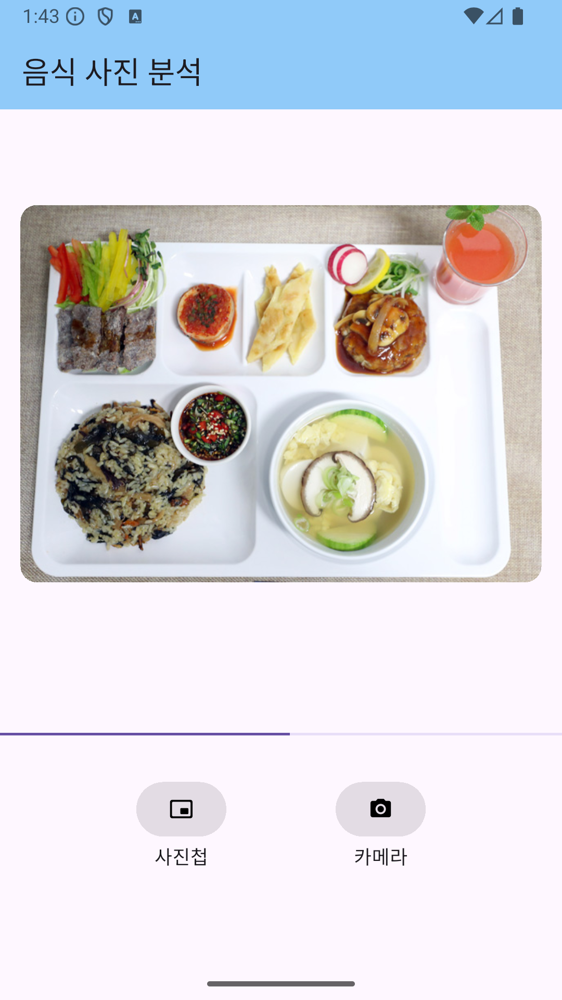
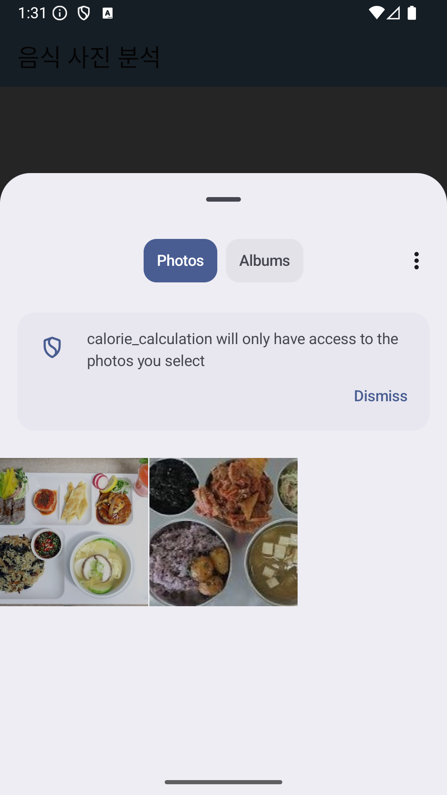
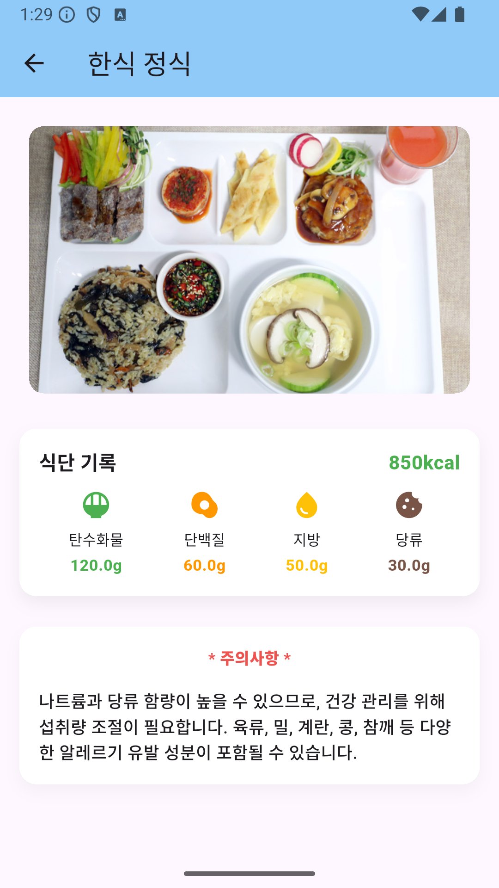

# 💬 Flutter 음식 칼로리 계산 어플

> Flutter와 Firebase에서 제공하는 제미나이 API를 활용하여 음식 칼로리 계산 앱을 구현한 프로젝트입니다.

 2025.12.22 ~ 2026. 1.5일 (프로젝트 종료)

---

## 목차
- [기술 스택](#-기술-스택)
- [주요 기능](#-주요-기능)
- [진행사항 및 에러사항](#-에러사항-수정사항)
- [커밋 컨벤션 가이드](#-커밋-컨벤션-가이드)
- [결과 화면](#-결과-화면)

---

## ⚒️ 기술 스택

  
  
  

---

## ✨ 주요 기능
- 음식 검색/선택 후 칼로리 확인
- 섭취량(단위/수량) 입력에 따른 칼로리 및 영양소 계산 및 주의사항

## 🏃 에러사항 및 수정사항

수정완료
- 프롬포트 수정
- kcal UI 업데이트 

## 📂 커밋 컨벤션 가이드

	•	feat: 새로운 기능 추가
	•	fix: 버그 수정
	•	docs: 문서 수정
	•	style: 코드 스타일 변경 (코드 포매팅, 세미콜론 누락 등)
	•	design: 사용자 UI 디자인 변경 (CSS 등)
	•	perf: 성능 개선
	•	chore: 자잘한 수정이나 빌드 업데이트
	•	rename: 파일 혹은 폴더명을 수정만 한 경우
	•	remove: 파일을 삭제만 한 경우
	•	test: 테스트 코드, 리팩토링 (Test Code)
	•	refactor: 리팩토링 (Production Code)
	•	build: 빌드 파일 수정
	•	ci: CI 설정 파일 수정

## 결과화면

<table>
  <tr>
    <td align="center">
      <b>① 음식 사진 분석 (등록 전)</b> 
      
    </td>
    <td align="center">
      <b>② 음식 사진 분석 (사진 등록 후)</b> 
      
    </td>
  </tr>
  <tr>
    <td align="center">
      <b>③ 사진첩 선택 화면</b> 
      
    </td>
    <td align="center">
      <b>④ 분석 결과 화면</b> 
      
    </td>
  </tr>
</table>

## 느낀점
 

음식 사진 이미지에 태깅을 달아서 무슨 음식인지까지 나타내고 싶었지만 제미나이 이미지 모델은 결제가 필요해 기각되었다. 
그 외에 방법으로는 이미지를 좌표화 해서 그 위에 stack으로 나타내는 방법도 있었지만 생각보다 정확하지 않아서 과감히 삭제했다.

이번 프로젝트를 하며 gpt를 내가 정한 기준보다 많이 사용했던것 같은데, AI가 코드를 작성하면 디버깅을 누구하냐는 여론의 몰매와 다르게 
오히려 gpt의 코드가 안정성과 유지관련 측면에서 이점이 더 높다는 생각을 했다. 
결론은 시대에 뒤처지지 않도록 유연한 사고를 가지고 더 많은 프로젝트를 통해 경험을 쌓야야 겠다. 

